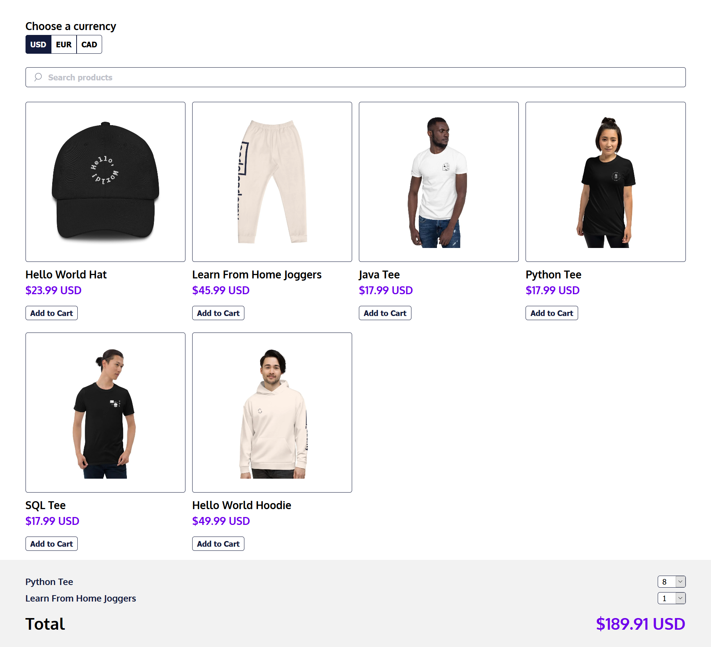

# Coders Store

A simple e-commerce website to understand the flow of REDUX

Check it live here: https://ashutosh-874.github.io/coders_store/

### Installation

1 - Setup the Project

```bash
git clone https://github.com/ashutosh-874/coders_store.git
cd coders_store
```

2 - Install Dependencies

```bash
npm install
```

3 - Runserver on port 3000

```bash
npm start
```

